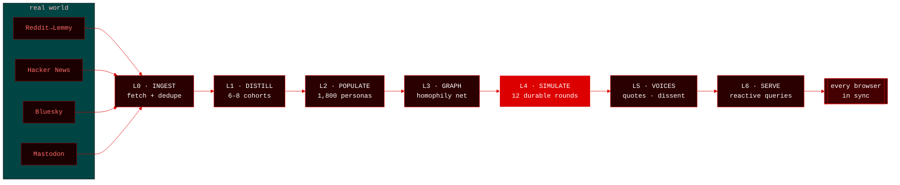
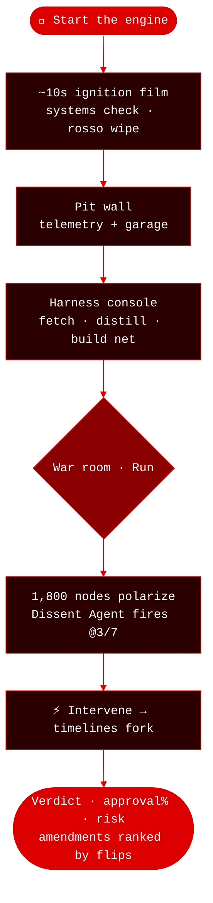

<div align="center">


<a href="https://github.com/ayushap18/agora"></a>

<br/>


</div>

---

> 🏁 **Paste a decision. Watch who it hurts — before it ships.**

Agora pulls **real posts** (Reddit·HN·Bluesky·Mastodon, +X import), distills them into
stakeholder **cohorts**, grows an **1,800-persona graph**, and runs a **durable
simulation** where opinions spread by bounded-confidence influence. Factions emerge, a
Dissent Agent names the quietly-hurt, and you can **fork the timeline mid-run** — all
streaming live to every open browser via Convex reactive queries. Wrapped in an F1
**pit-wall skin**: crank the engine, lights out, run the lap.

## ⚡ Run it

```sh
npm install
CONVEX_AGENT_MODE=anonymous npx convex dev   # local backend, no account
npx vite --port 8642                          # second terminal → localhost:8642
```

Optional real LLM voices: `npx convex env set GEMINI_API_KEY <key>`. No key → deterministic
fallback from the real corpus, nothing blocks.

## 🏎️ The pipeline — 7 layers, all live



`L4` is a **Convex Workflow** — kill `convex dev` mid-run, restart, it resumes where it
died. `L5` runs on a **Workpool** (4-parallel) + **Rate Limiter** (8/min). `L6` is plain
reactive queries — **zero websocket code of ours**. Stance math is deterministic and
seeded; LLMs voice the debate, they never move the numbers.

## 🏁 One lap



Copy the URL (`#run=<id>`) into another browser/device → identical live state, no refresh.
That's the whole pitch in one gesture.

## 🔧 Extras

| Command | What |
|---|---|
| `cd scraper && go run . -q "…" -pages 4` | Go sidecar — concurrent scrape, ~550 posts/~5s, bulk-insert via HTTP |
| `ruby cache/corpus_cache.rb pull\|replay -q "…"` | snapshot/replay corpus offline, zero network |
| `npx convex run selftest:run` | prove engine invariants (determinism, bounds, conservation) |
| `npx convex run ops:cleanup` | keep latest baseline + forks, cascade-delete the rest |
| ⚙ Settings | BYOK Gemini · Ollama · HF token · rounds 6–20 · tick speed · model council |

**LLM tiers:** local (Ollama) → Gemini → deterministic fallback; the pit wall shows which
is live. **Model council:** each configured model blind-predicts final approval%; scored
against the engine's ground truth (100 − |error|).

## 📁 Repo map

```
convex/     schema · ingest · distill · populate · engine · sim(workflow) · voices · serve · council · selftest · ops
src/        main.js (war-room canvas/SVG + Convex adapters + pit-wall chrome) · ignition.js (engine-start film)
index.html  all views — landing · pit wall · harness · war room · settings
scraper/    Go corpus sidecar          cache/  Ruby corpus cache          docs/  design spec + plan
```

<div align="center"><sub>Nav · <b>Home → Pit wall → Harness → War room → Settings</b> · every screen mirrors the same lap 🔴</sub></div>
